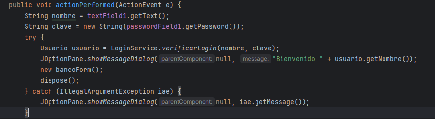
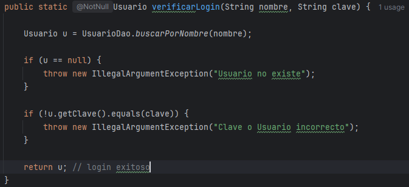
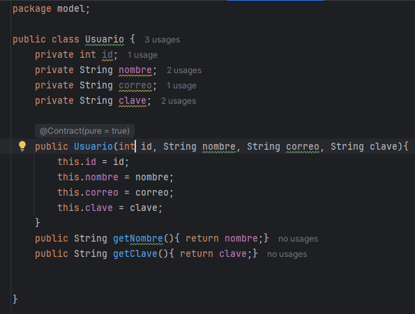
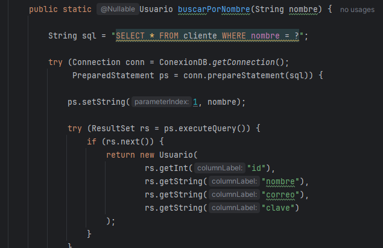
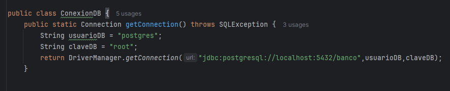
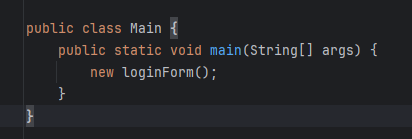
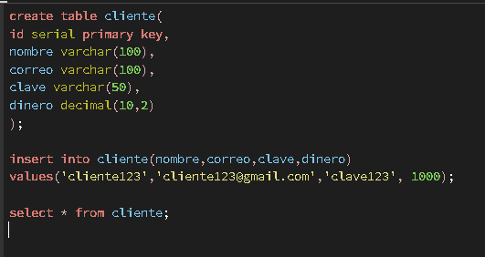
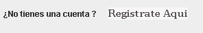
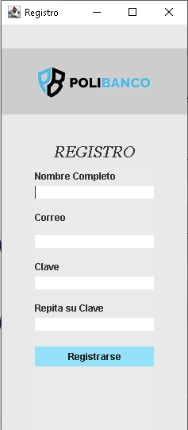

## Detalle de los form y cómo se conectan
* Primero lo que hice fue estructurar mis carpetas para intentar seguir una lógica de capas
Los form en la UI solo llaman a un metodo el cual es la lógica

* Validaciones
La logica es la que se encarga de las validaciones, por ejemplo comprobar si hay campos vacios o que las contraseñas coincidad con 
las registradas en la Base de datos

* Tambien hice el modelo, la cual es la entidad del mundo real 
En esta parte declaro u objeto el cual me ayudara a ser el que tenga temporalmente los datos rescatados de la base de datos

* La capa de Datos
Es la que me ayuda tanto a hacer los Select, abrir la conexion y a que sus metodos puedan ser utilizados por la Logica

* El Main
Solo se hace el llamado a la pantalla del login

* Base de datos
En la Base de datos puse el Usuario y la contraseña quemada

### EXTRAS DE MI PARTE
* Agregue un boton para que se puedan registrar cuentas 
Al darle click te salta el formulario y si todo va bien te registra en la base de datos

